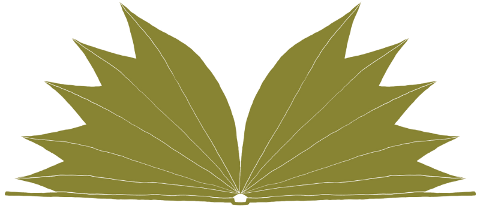

# BookLeaf

BookLeaf is a 2D unstructured hydrodynamics mini-app.

## Installation

BookLeaf can be installed using [Spack](https://spack.io/).

```
spack install bookleaf-cpp
```

For instructions on building BookLeaf manually, see
[INSTALL.md](docs/INSTALL.md).

## Further documentation

Further documentation can be found in the `doc/` subdirectory. The following
documentation is available:

- [INSTALL.md](doc/INSTALL.md), manual installation instructions
- [STRUCTURE.md](doc/STRUCTURE.md), code and physics structure
- [CALIPER.md](doc/CALIPER.md), how to use LLNL Caliper
- [GIT.md](doc/GIT.md), git organisation

## Release history

* 23/05/2018, version 2.0.1
* 02/05/2018, version 2.0
