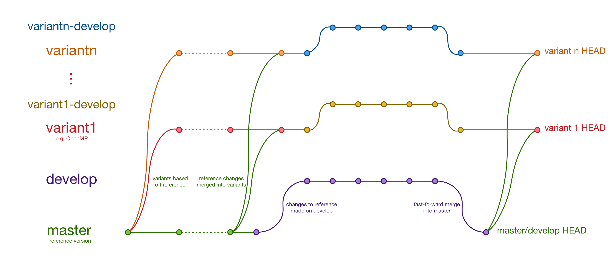

# Git repository structure

BookLeaf's `master` branch represents the reference version of the application,
parallelised only with MPI. Changes to this version should be made on the
`develop` branch, and subsequently merged into `master`. Other parallel variants
(either on top of MPI or instead of it) are maintained on separate branches
(with their own analogous `*-develop` branches. The diagram below illustrates
how these branches relate to each other.

