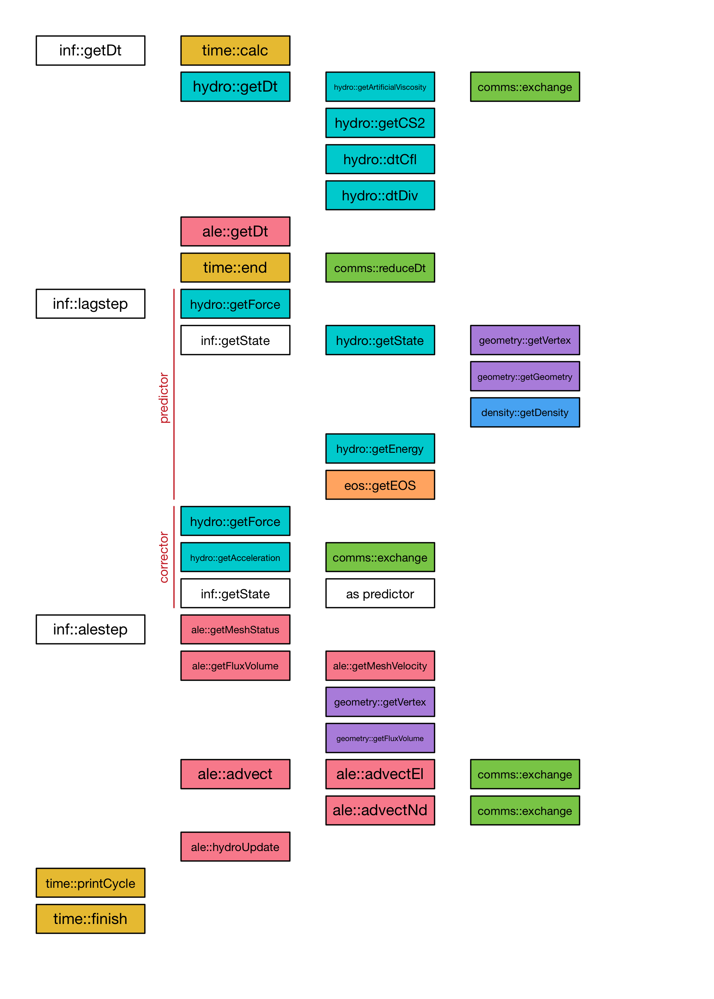

# BookLeaf Documentation

## Code structure

The BookLeaf code is structured into 4 main categories: common, packages,
utilities and infrastructure.

**common** contains general code handling data storage and data manipulation
interfaces, general runtime configuration and error handling.

Each **package** is designed to expose a self-contained set of functionality.
For example the hydro package contains the code implementing the hydrodynamics
physics.  Within packages, functionality is separated into *drivers* and
*kernels*. Client code should only call the drivers, which will delegate to
kernels to do the bulk of the work.

Package drivers can call **utilities**, which are similar to packages but
contain functionality used by multiple packages. Utilities reduce code
duplication.  The distributed communication utility in comms is an example of a
utility that is used by multiple packages.

Finally, the **infrastructure** code organises calls to package drivers and
utilities to structure the simulation as a whole.

## Step structure

The `solver()` method in the infrastructure package contains the main loop. The
following diagram shows the structure of each iteration (coloured coded by
package and utility):

### Kernels

BookLeaf's main computational core consists of approximately 35 kernels which
are combined to advance the simulation state each timestep. Here we use the term
kernel to mean a self-contained loop over the mesh, which does some computation
and updates one or more quantities. The kernels are designed to be suitable for
efficient execution on modern parallel hardware. The rest of the code handles
coordinating the execution of the kernels.
